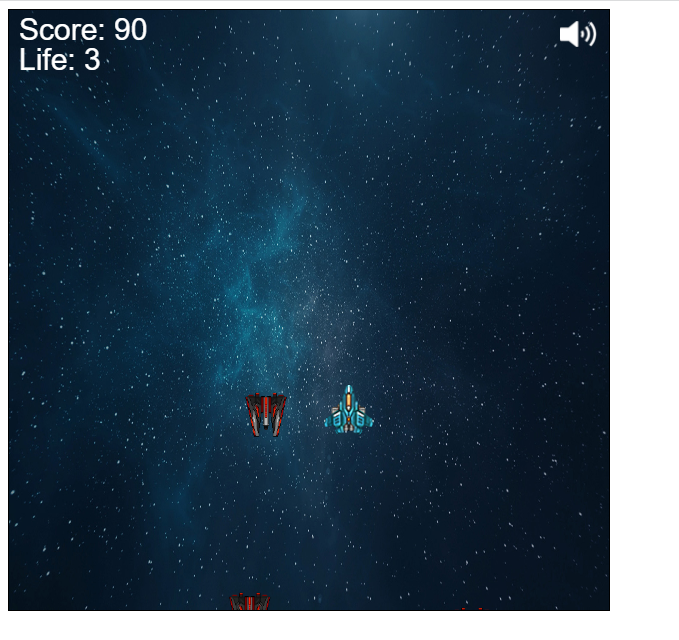

# SpaceInvaderGitCopilot
<h2>Game Desc<h2>

the space invaders consist of two parts: the player and the enemies 
the player is controlled by the keyboard and the enemies are controlled by the game
when the player is hit by an enemy, the player is destroyed and the game is over

PS:This project all made by github copilot
<h2>Image of game<h2>
</img>
